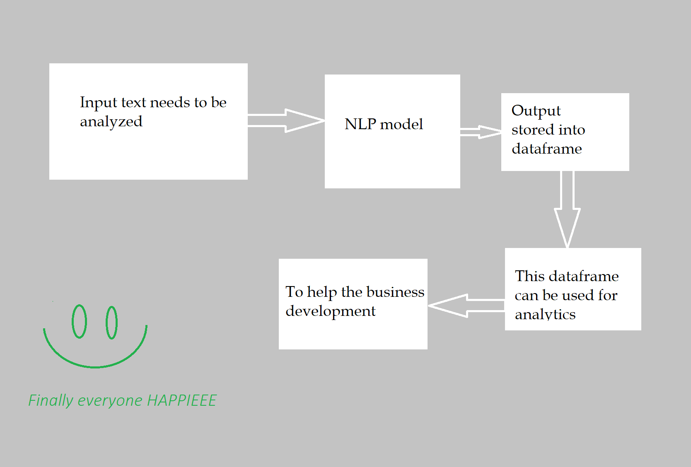

# Sentiment-Analysis-to-Dataframe
This project will give you clear idea on how to grab overall context of a long sentence(s) that are hectic to read, you can use one of the popular AI technique - Natural Language Processing. This file contains 3 notebook instances.
First go through this file to know meaning of every line : <a href="https://github.com/iamBHK/Sentiment-Analysis-to-Dataframe/blob/main/NLP%20Sentiment%20Analysis%20to%20CSV.ipynb">NLP Sentiment Analysis to CSV.ipynb</a>
<!--  -->

<!--  -->

1. NLP_Lib.ipynb this file contains all the libraried that are needed to run these NLP models.
2. Model+Run.ipynb file contains some of the NLP models.
2. Models are integrated from Huggingface platform, we do have various other platforms for this purpose.
3. You can pipeline the models instead of manual task.
4. These models can be increased by looking up your favourite here : https://huggingface.co/models?sort=downloads&search=sentiment+analysis
